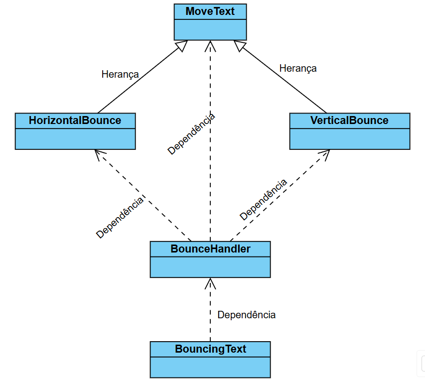

# Diagrama UML

<h4>Imagem 1 - Representação visual da relação entre classes</h4>

#  Refatoração, UML, Herança e Recursos de Áudio

## Descrição Geral
Você deverá partir do projeto existente, que mostra um texto se movimentando pela tela no estilo “DVD” (batendo nas bordas). O objetivo é refatorar o código para torná-lo mais organizado (clean code), adicionar novos comportamentos de movimento (herança e subclasses) e incorporar recursos de áudio (sons e música), além de criar diagramas UML que descrevam tanto o projeto atual quanto a versão final após as melhorias.

## Itens a Desenvolver
#### Diagrama UML

- Crie um diagrama UML que represente a estrutura atual do projeto (antes da refatoração).
Em seguida, crie um segundo diagrama UML que mostre a nova estrutura após as alterações sugeridas (depois da refatoração).
Os diagramas devem evidenciar as classes, os principais atributos e métodos, bem como as relações de herança (ou de uso).

#### Refatorar o Código para “Clean Code”

- Retirar a função _non_zero() ou encontrar outra forma de gerar velocidades iniciais para o texto, evitando overhead ou repetições desnecessárias.

- Eliminar “números mágicos” (valores fixos no meio do código) e movê-los para constantes ou para o arquivo config.py.
  
- Padronizar nomes de variáveis e métodos para que sejam mais expressivos (caso necessário).
  
- Separar responsabilidades em módulos ou classes distintas (cores, configuração, lógica de jogo, lógica de movimento, etc.) [Caso necessário].

### Criar uma Superclasse MoveTexto

- Essa classe deve conter os atributos e comportamentos básicos para renderizar e desenhar texto na tela, além de armazenar posição e dimensões.

- Deve possuir um método update() (abstrato ou genérico) que será sobrescrito pelas subclasses.

### Criar Três Subclasses que Herdam de MoveTexto

- Classe de texto que “quica”: implementa colisão com as bordas e muda de cor.
  
- Classe de texto que se move apenas na vertical: implementa colisão com as bordas e muda de cor.
  
- Classe de texto que se move apenas na horizontal (pode ser semelhante ao comportamento atual do projeto) [refatorar para ser uma subclasse].
  

### Adicionar Sons e Música

- Incluir efeito sonoro ao bater na borda.
  
- Adicionar música de fundo que deve tocar em loop.
  
- Permitir que o usuário troque de música ao apertar a tecla S, pausar com SPACE e start com a mesma tecla. (Isso pode significar tocar um outro arquivo de música ou pausar e retomar a música, dependendo da escolha)

### Docstrings

- Incluir docstrings em todas as classes e em seus métodos principais, explicando resumidamente o propósito de cada um.
  
- Usar docstrings no formato Python (três aspas """), descrevendo parâmetros e retornos de cada método, caso aplicável.

Documentar no README os diagramas UML e o código - evidenciando o SOLID e Clean Code.
  
 

